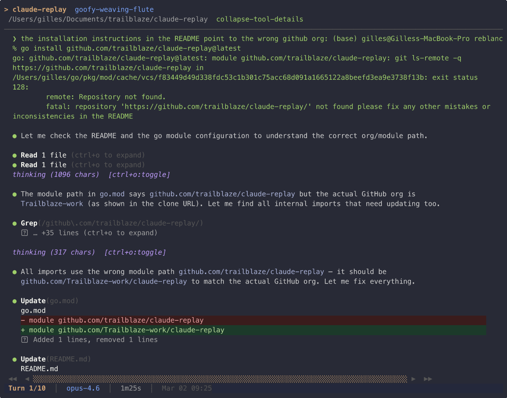

# claude-replay

A TUI tool to browse and replay [Claude Code](https://docs.anthropic.com/en/docs/claude-code) sessions from `~/.claude`. Navigate through turns, view tool calls, toggle thinking blocks, and export recordings.

Built with [Bubble Tea](https://github.com/charmbracelet/bubbletea), [Lip Gloss](https://github.com/charmbracelet/lipgloss), and [Glamour](https://github.com/charmbracelet/glamour).



## Install

```bash
go install github.com/trailblaze/claude-replay@latest
```

Or build from source:

```bash
git clone https://github.com/Trailblaze-work/claude-replay.git
cd claude-replay
go build -o claude-replay .
```

## Usage

### Browse (default)

```bash
claude-replay
```

Opens an interactive browser to explore all your Claude Code projects and sessions. Select a project, pick a session, and replay it.

### Play a specific session

```bash
claude-replay play <session-id>       # by UUID or UUID prefix
claude-replay play <slug>             # by session slug
claude-replay play /path/to/file.jsonl # by file path
```

### List (non-interactive)

```bash
claude-replay list                    # list all projects
claude-replay list <project-name>     # list sessions in a project
```

### Export as asciinema recording

```bash
claude-replay export <session> -o session.cast
claude-replay export <session> --mode realtime -o session.cast
claude-replay export <session> --mode fast -o session.cast
```

Play the recording with `asciinema play session.cast` or upload to [asciinema.org](https://asciinema.org).

**Timing modes:**

| Mode | Behavior |
|------|----------|
| `compressed` (default) | Fixed 2s delay between turns |
| `realtime` | Uses actual timestamps from the session |
| `fast` | 2x speed of real timestamps |
| `instant` | Minimal delays, shows final state of each turn |

## Key Bindings

### Browse screens
| Key | Action |
|-----|--------|
| `Enter` | Select project/session |
| `/` | Filter |
| `Esc` | Back |
| `q` | Quit |

### Replay screen
| Key | Action |
|-----|--------|
| `←/h` `→/l` | Previous/next turn |
| `Home/g` `End/G` | First/last turn |
| `↑/k` `↓/j` | Scroll within turn |
| `PgUp` `PgDn` | Page up/down |
| `t` | Toggle thinking blocks |
| `Enter` | Expand/collapse tool results |
| `Space` | Toggle autoplay |
| `+/-` | Adjust autoplay speed |
| `?` | Help overlay |
| `Esc` | Back to session list |

## Git Mode

Browse sessions stored on a `claude-sessions` git branch (as created by [claude-session-trail](https://github.com/Trailblaze-work/claude-session-trail)):

```bash
claude-replay --git                    # browse sessions from current repo
claude-replay --git list               # list sessions non-interactively
claude-replay --git play <session-id>  # replay a session
claude-replay --git export <id> -o out.cast
claude-replay --git --git-repo /path/to/repo   # specify repo path
```

## Flags

| Flag | Default | Description |
|------|---------|-------------|
| `--claude-dir` | `~/.claude` | Path to Claude Code data directory |
| `--git` | `false` | Browse sessions from a `claude-sessions` git branch |
| `--git-repo` | current directory | Path to git repository (used with `--git`) |

## License

MIT

---

<p align="center">
  <a href="https://trailblaze.work">
    
  </a>
</p>
<h3 align="center">Built by <a href="https://trailblaze.work">Trailblaze</a></h3>
<p align="center">
  We help companies deploy AI across their workforce.<br>
  Strategy, implementation, training, and governance.<br><br>
  <a href="mailto:hello@trailblaze.work"><strong>hello@trailblaze.work</strong></a>
</p>
